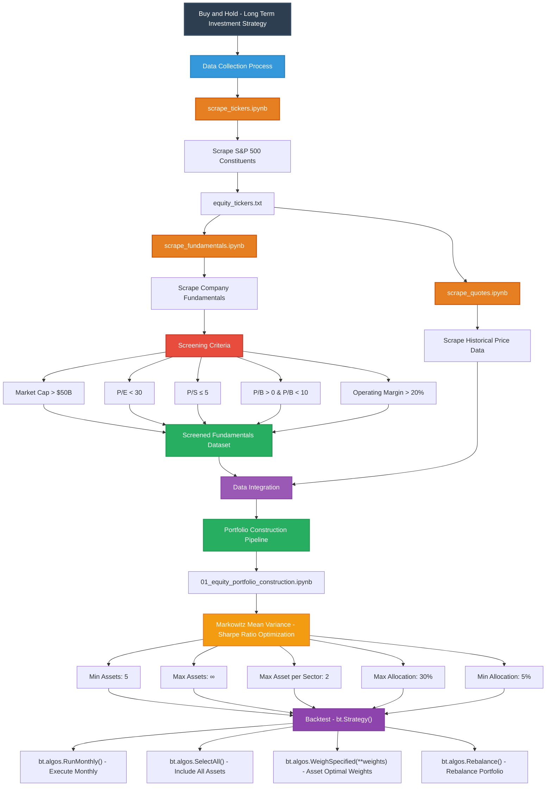

# Team 8 - Algo Trading (Buy & Hold Strategy)

## Poject Overview
This project implements a Buy and Hold investment strategy using Python, focusing on long-term equity investments. The strategy is designed to select high-quality stocks based on fundamental analysis and optimize the portfolio for maximum returns.



## Getting Started

```bash
# Clone the repository
git clone https://github.com/renan-peres/mfin-portfolio-management.git
cd mfin-portfolio-management

# Install Astral UV (for reproducible venvs)
curl -LsSf https://astral.sh/uv/install.sh | env INSTALLER_NO_MODIFY_PATH=1 sh
uv venv                                 # or: python3 -m venv .venv
source .venv/bin/activate               # or: source venv/bin/activate 

# Install dependencies
uv pip install -r requirements.txt 
```