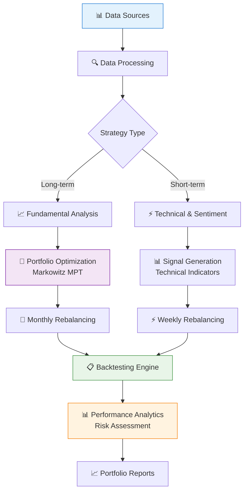

# 🚀 Algorithmic Trading Portfolio Management

[](https://www.python.org/downloads/)
[](LICENSE)
[](https://github.com/psf/black)

> A sophisticated algorithmic trading system implementing both buy-and-hold and short-term trading strategies using modern portfolio theory and quantitative analysis.

## 📋 Table of Contents

- [🎯 Project Overview](#-project-overview)
- [✨ Key Features](#-key-features)
- [🏗️ System Architecture](#-system-architecture)
- [🚀 Quick Start](#-quick-start)
- [📊 Strategy Details](#-strategy-details)
- [🔧 Configuration](#-configuration)
- [📁 Project Structure](#-project-structure)
- [🧪 Testing](#-testing)
- [📖 Documentation](#-documentation)

## 🎯 Project Overview

This project implements a comprehensive algorithmic trading system that combines:
- **Long-term investment strategies** using Modern Portfolio Theory (Markowitz optimization)
- **Short-term trading strategies** with technical indicators and sentiment analysis
- **Risk management** through systematic backtesting and performance evaluation
- **Automated execution** via scheduled pipelines and monitoring

## ✨ Key Features

### 📊 **Data Collection & Processing**
- **Multi-source data aggregation**: Yahoo Finance, OpenBB, Financial Modeling Prep API
- **Real-time & historical data**: Stock prices, fundamentals, economic indicators
- **News sentiment analysis**: TextBlob-based sentiment scoring
- **Efficient data storage**: Polars & DuckDB for high-performance analytics

### 🎯 **Portfolio Strategies**

#### Long-term Strategy (Buy & Hold)
- **Markowitz Mean-Variance Optimization**
- **Fundamental screening criteria**:
  - Market Cap: $50B - $500B
  - P/E Ratio: < 30
  - P/S Ratio: ≤ 5
  - P/B Ratio: 0 < x ≤ 10
  - Operating Margin: > 20%
- **Sector diversification constraints**
- **Monthly rebalancing**

#### Short-term Strategy
- **Technical indicator integration**
- **Sentiment-driven signals**
- **Weekly rebalancing**
- **Risk-adjusted position sizing**

### 📈 **Advanced Analytics**
- **QuantStats integration** for comprehensive performance reporting
- **Statistical significance testing**
- **Monte Carlo simulations**
- **Drawdown analysis and risk metrics**

## 🎨 System Architecture

## 🎨 System Architecture

### High-Level System Flow


### Long-Term Strategy Workflow

```mermaid
flowchart TD
    Start{📊 Equities Portfolio} --> Split[🚀 S&P 500 Stocks]
    
    Split -->|"85% Allocation"| LongTerm["📈 Long-Term Strategy<br/>(Quartely Review)"]
    Split -->|"15% Allocation"| ShortTerm["⚡ Short-Term Strategy<br/>(Weekly Review)"]
    
    %% Long-Term Portfolio Flow
    LongTerm --> Screen[🔍 Fundamental Screening]
    
    Screen -->|"Market Cap:<br/>$50B - $500B"| Valid1[✅ Size Filter]
    Screen -->|"Valuation:<br/>P/E < 30, P/S ≤ 5, P/B: 0-10"| Valid2[✅ Value Filter]
    Screen -->|"Efficiency:<br/>Op Margin > 20%"| Valid3[✅ Efficiency Filter]
    
    Valid1 --> Collect[📥 Screened Assets]
    Valid2 --> Collect
    Valid3 --> Collect
    
    Collect --> Price[💹 Historical Price Data]
    Price --> Returns[📈 Return & Risk Metrics]
    Returns --> Covariance[⚙️ Covariance Matrix]
    
    Covariance --> Optimize["🎯 Markowitz Model<br/>(Sharpe Ratio Optimization)"]
    
    Optimize --> LongPortfolio[🏆 Long-Term Portfolio<br/>Weights & Allocations]
    
    %% Short-Term Portfolio Flow
    ShortTerm --> TechData[📊 Technical Data Collection]
    ShortTerm --> NewsData[📰 News & Sentiment Data]
    
    TechData --> Indicators[📈 Technical Indicators<br/>RSI, MACD, Bollinger Bands]
    NewsData --> Sentiment[🎭 Sentiment Analysis<br/>TextBlob Scoring]
    
    Indicators --> SignalGen[⚡ Signal Generation<br/>Buy/Sell/Hold]
    Sentiment --> SignalGen
    
    SignalGen --> RiskSize[⚖️ Risk-Adjusted<br/>Position Sizing]
    RiskSize --> ShortPortfolio[🎯 Short-Term Portfolio<br/>Active Positions]
    
    %% Combined Flow
    LongPortfolio --> CombinePort["🔄 Master Strategy <br/>(Portfolios Combination)"]
    ShortPortfolio --> CombinePort
    
    CombinePort --> FinalBacktest[📊 Combined Backtesting]
    FinalBacktest --> FinalEval["📊 Performance Evaluation<br/>(Benchmark Comparison)"]
    
    %% Styling
    style Start fill:#e3f2fd,stroke:#1976d2,stroke-width:2px,color:#000000
    style Split fill:#fff3e0,stroke:#f57c00,stroke-width:3px,color:#000000
    style LongTerm fill:#e8f5e8,stroke:#4caf50,stroke-width:2px,color:#000000
    style ShortTerm fill:#ffebee,stroke:#f44336,stroke-width:2px,color:#000000
    
    %% Long-term styling
    style Screen fill:#fff3e0,stroke:#f57c00,stroke-width:2px,color:#000000
    style Valid1 fill:#e8f5e8,stroke:#4caf50,stroke-width:2px,color:#000000
    style Valid2 fill:#e8f5e8,stroke:#4caf50,stroke-width:2px,color:#000000
    style Valid3 fill:#e8f5e8,stroke:#4caf50,stroke-width:2px,color:#000000
    style Collect fill:#f3e5f5,stroke:#9c27b0,stroke-width:2px,color:#000000
    style Price fill:#ffffff,stroke:#333333,stroke-width:2px,color:#000000
    style Returns fill:#ffffff,stroke:#333333,stroke-width:2px,color:#000000
    style Covariance fill:#ffffff,stroke:#333333,stroke-width:2px,color:#000000
    style Optimize fill:#f3e5f5,stroke:#7b1fa2,stroke-width:3px,color:#000000
    style LongPortfolio fill:#e8f5e8,stroke:#388e3c,stroke-width:3px,color:#000000
    
    %% Short-term styling
    style TechData fill:#fff3e0,stroke:#ff9800,stroke-width:2px,color:#000000
    style NewsData fill:#fff3e0,stroke:#ff9800,stroke-width:2px,color:#000000
    style Indicators fill:#ffebee,stroke:#e91e63,stroke-width:2px,color:#000000
    style Sentiment fill:#ffebee,stroke:#e91e63,stroke-width:2px,color:#000000
    style SignalGen fill:#f3e5f5,stroke:#9c27b0,stroke-width:2px,color:#000000
    style RiskSize fill:#ffffff,stroke:#333333,stroke-width:2px,color:#000000
    style ShortPortfolio fill:#ffebee,stroke:#d32f2f,stroke-width:3px,color:#000000
    
    %% Combined styling
    style CombinePort fill:#e1f5fe,stroke:#0288d1,stroke-width:3px,color:#000000
    style FinalBacktest fill:#fff8e1,stroke:#ffa000,stroke-width:2px,color:#000000
    style FinalEval fill:#fce4ec,stroke:#c2185b,stroke-width:3px,color:#000000
    
    %% Subgraphs positioned side by side
    subgraph LongTermFlow[" "]
        direction TB
        Screen
        Valid1
        Valid2
        Valid3
        Collect
        Price
        Returns
        Covariance
        Optimize
        LongPortfolio
    end
    
    subgraph ShortTermFlow[" "]
        direction TB
        TechData
        NewsData
        Indicators
        Sentiment
        SignalGen
        RiskSize
        ShortPortfolio
    end
    
    %% Subgraph styling
    style LongTermFlow fill:#f8f9fa,stroke:#4caf50,stroke-width:2px,stroke-dasharray: 5 5
    style ShortTermFlow fill:#f8f9fa,stroke:#f44336,stroke-width:2px,stroke-dasharray: 5 5
```


## 🚀 Quick Start

### Prerequisites
- Python 3.8+
- API Keys (optional but recommended):
  - Financial Modeling Prep API
  - OpenBB Terminal

### Installation

```bash
# Clone the repository
git clone https://github.com/renan-peres/mfin-algo-trading-team.git
cd mfin-algo-trading-team

# Install Astral UV (for reproducible venvs)
curl -LsSf https://astral.sh/uv/install.sh | env INSTALLER_NO_MODIFY_PATH=1 sh

# Create virtual environment
uv venv                                 # or: python3 -m venv .venv
source .venv/bin/activate               # or: source venv/bin/activate 

# Install dependencies
pip install -r requirements.txt

# Set up environment variables (optional)
cp .env.example .env
# Edit .env with your API keys
```

### Quick Run

```bash
# Run the complete pipeline
bash pipelines/weekly_pipeline.sh

# Or run individual components
jupyter notebook notebooks/01_data_collection.ipynb
```

## 📊 Strategy Details

### Long-term Portfolio Construction

1. **Data Collection**: Scrape S&P 500 constituents and fundamental data
2. **Screening**: Apply fundamental filters to identify quality stocks
3. **Optimization**: Use Markowitz optimization with constraints:
   - Minimum 5 assets, maximum 30% allocation per asset
   - Maximum 2 assets per sector
   - Minimum 5% allocation per selected asset
4. **Backtesting**: Monthly rebalancing with transaction cost modeling

## 🔧 Configuration

### Environment Variables

```bash
# API Configuration
FMP_API_KEY=your_fmp_api_key
OPENBB_API_KEY=your_openbb_key

# Portfolio Parameters
MIN_ASSETS=5
MAX_ALLOCATION=0.30
MIN_ALLOCATION=0.05
REBALANCING_FREQUENCY=monthly

# Risk Management
RISK_FREE_RATE=0.02
MAX_DRAWDOWN_THRESHOLD=0.25
```

### Strategy Configuration

```python
# config/trading_config.py
SCREENING_CRITERIA = {
    "market_cap": {"min": 50e9, "max": 500e9},
    "pe_ratio": {"max": 30},
    "ps_ratio": {"max": 5},
    "pb_ratio": {"min": 0, "max": 10},
    "operating_margin": {"min": 0.20}
}

PORTFOLIO_CONSTRAINTS = {
    "min_assets": 5,
    "max_allocation": 0.30,
    "min_allocation": 0.05,
    "max_sector_allocation": 2
}
```

## 📁 Project Structure

```
mfin-algo-trading-team/
├── 📁 src/                    # Source code
│   ├── data_collection/       # Data scraping modules
│   ├── portfolio/            # Portfolio optimization
│   ├── backtesting/          # Strategy testing
│   └── analysis/             # Performance analysis
├── 📁 notebooks/             # Jupyter notebooks
│   ├── 01_data_collection.ipynb
│   ├── 02_portfolio_optimization.ipynb
│   ├── 03_backtesting.ipynb
│   └── 04_performance_analysis.ipynb
├── 📁 data/                  # Data storage
│   ├── raw/                  # Raw market data
│   ├── processed/            # Cleaned datasets
│   └── results/              # Analysis outputs
├── 📁 tests/                 # Test suite
├── 📁 config/                # Configuration files
├── 📁 pipelines/             # Automation scripts
└── 📁 docs/                  # Documentation
```

## 🧪 Testing

```bash
# Run all tests
pytest tests/

# Run specific test categories
pytest tests/test_portfolio.py -v
pytest tests/test_data_collection.py -v

# Run with coverage
pytest --cov=src tests/
```

## 📊 Performance Dashboard

The system generates comprehensive performance reports including:

- **Portfolio Performance**: Returns, volatility, Sharpe ratio
- **Risk Analysis**: VaR, CVaR, maximum drawdown
- **Attribution Analysis**: Sector and security contribution
- **Benchmark Comparison**: Alpha, beta, information ratio

## 🔄 Automated Pipelines

The system includes automated pipelines for:

```bash
# Weekly data update and rebalancing
bash pipelines/weekly_pipeline.sh

# Monthly performance reporting
bash pipelines/monthly_report.sh

# Risk monitoring (daily)
bash pipelines/risk_monitor.sh
```

## 📄 License

This project is licensed under the MIT License - see the [LICENSE](LICENSE) file for details.

## 🙏 Acknowledgments

- **Modern Portfolio Theory**: Harry Markowitz
- **QuantStats**: Performance analytics library
- **OpenBB Platform**: Financial data integration
- **bt Library**: Backtesting framework

---

**⚠️ Disclaimer**: This software is for educational and research purposes only. Past performance does not guarantee future results. Always consult with financial advisors before making investment decisions.
